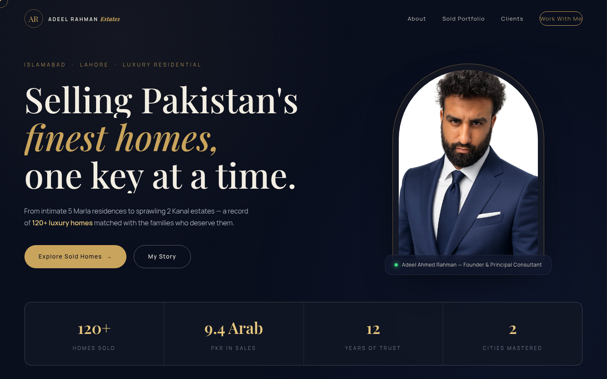
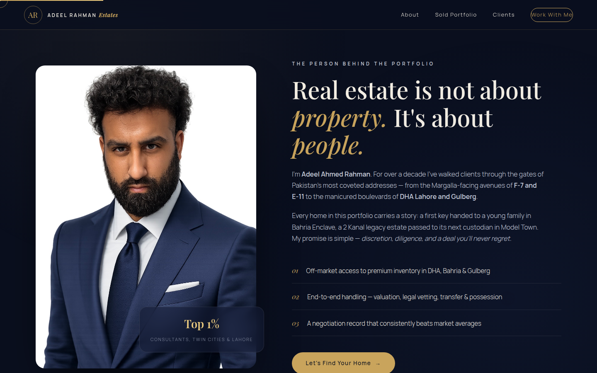
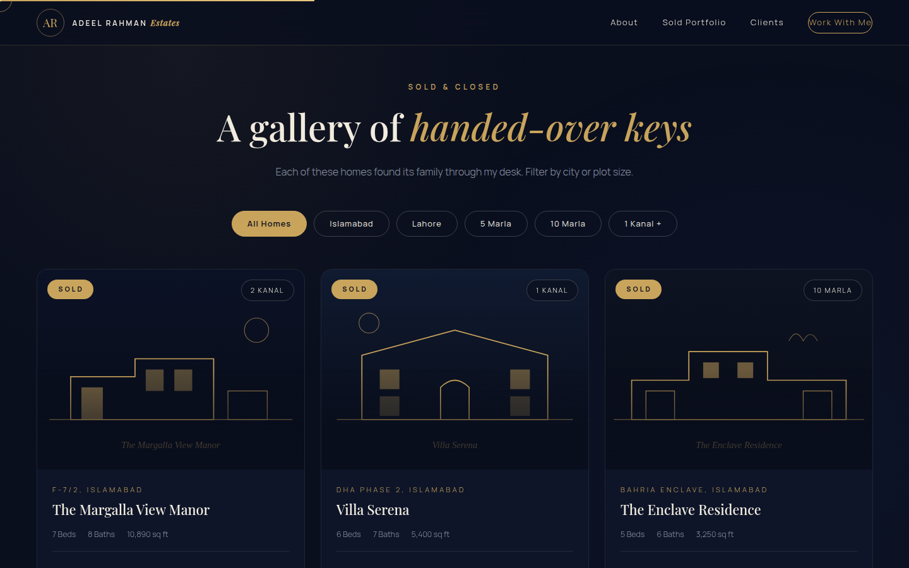
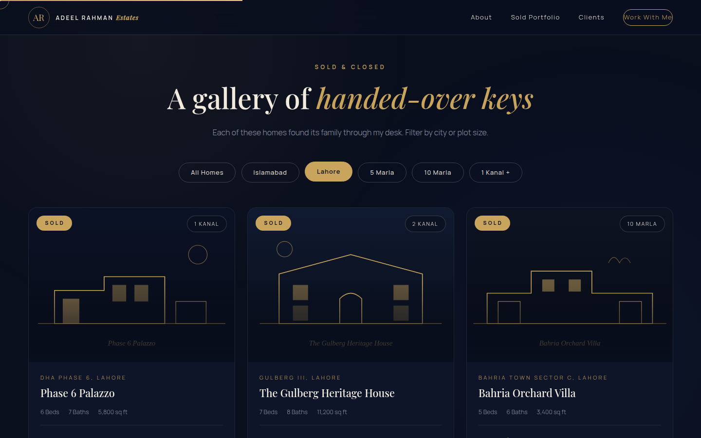
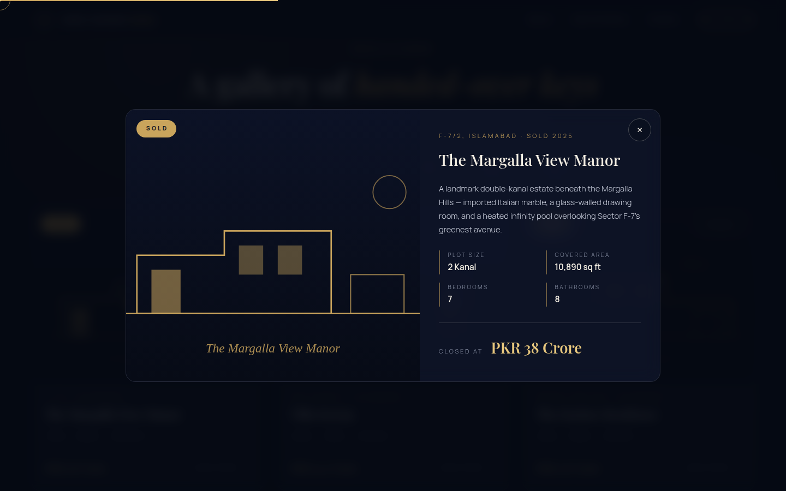
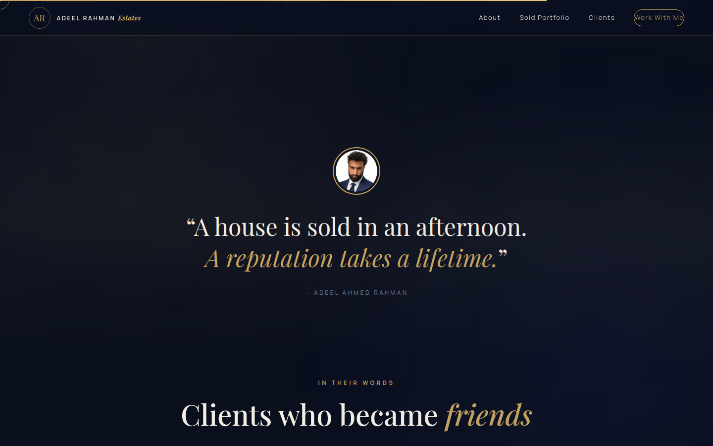
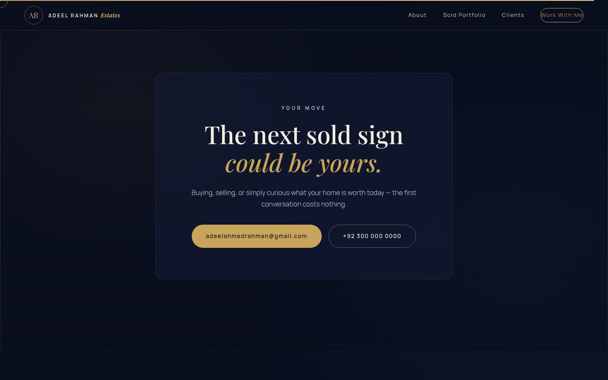
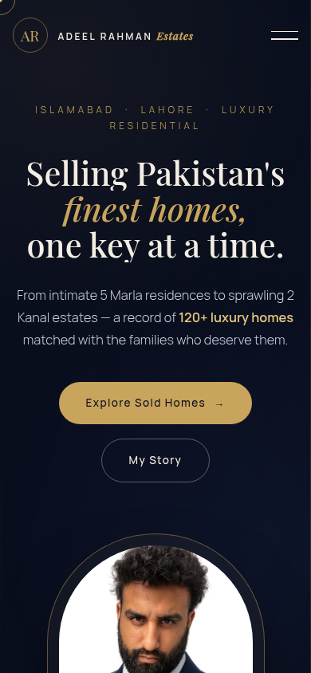

# Adeel Ahmed Rahman — Luxury Real Estate Portfolio

A highly interactive, single-page portfolio showcasing luxury homes sold across
**Islamabad** and **Lahore** — 5 Marla, 10 Marla, 1 Kanal and beyond.

**Stack:** Pure HTML/CSS/JS · GSAP + ScrollTrigger · Lenis smooth scroll · No build step.

**Highlights**

- Cinematic preloader, custom cursor, magnetic buttons, scroll-progress bar
- Hero with staggered headline reveal, parallax background and animated counters
- Filterable sold-homes gallery (city + plot size) with animated transitions
- Story lightbox for every home, auto-playing testimonial slider, marquee of addresses
- Fully responsive, and degrades gracefully if CDNs/photos are unreachable
  (elegant gold line-art villas swap in automatically)

## Run it

Open `index.html` in a browser, or serve the folder:

```bash
cd portfolio && python3 -m http.server 8000
```

To publish on **GitHub Pages**: Settings → Pages → deploy from this branch,
folder `/portfolio` (or copy this folder to the repo root of a `gh-pages` branch).

## Preview

### Hero


### About


### Sold Portfolio (with offline fallback art — real visitors see photographs)


### Filtered — Lahore


### Property Story Lightbox


### Quote Band


### Contact


### Mobile

